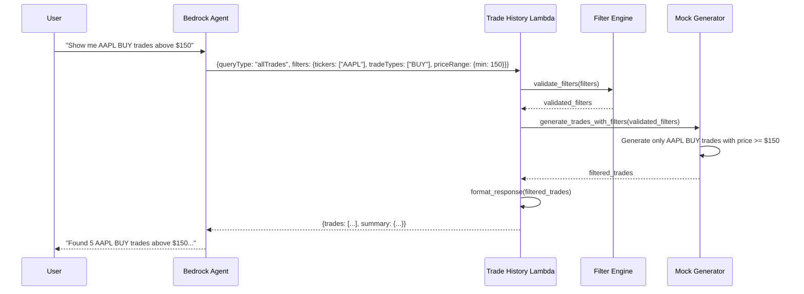
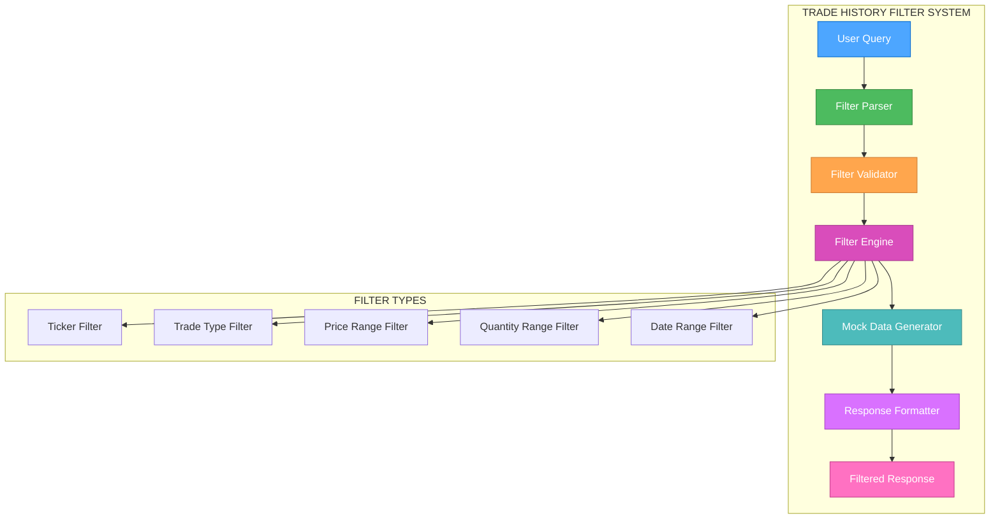

# 🎨🎨🎨 ENTERING CREATIVE PHASE: TRADE HISTORY FILTER ARCHITECTURE 🎨🎨🎨

## PROBLEM STATEMENT

The current trade_history lambda function generates mock trade data but lacks filtering capabilities. Users need to filter trade history by:
- **Ticker symbols** (e.g., "show me AAPL trades only")
- **Trade types** (BUY/SELL)
- **Date ranges** (beyond the current time_frame parameter)
- **Price ranges** (e.g., "trades above $100")
- **Quantity ranges** (e.g., "trades with quantity > 50")

The filtering system must:
- Maintain <2s response time requirement
- Support multiple filter combinations
- Provide clear error handling for invalid filters
- Generate realistic filtered mock data
- Integrate seamlessly with existing Bedrock Agent workflow

## COMPONENT ANALYSIS

### Current Architecture
```
User Query → Bedrock Agent → Trade History Lambda → Mock Data Generation → Response
```

### Enhanced Architecture with Filters
```
User Query → Bedrock Agent → Trade History Lambda → Filter Engine → Mock Data Generation → Filtered Response
```

### Core Components
- **Filter Parser**: Parse filter parameters from input
- **Filter Engine**: Apply filters to mock data generation
- **Mock Data Generator**: Enhanced to respect filter constraints
- **Response Formatter**: Include filter summary in response

## OPTIONS ANALYSIS

### Option 1: In-Memory Filtering (Post-Generation)
**Description**: Generate all mock data first, then filter in memory
**Pros**:
- Simple implementation
- Maintains existing mock data generation logic
- Easy to add new filter types
- Predictable performance
**Cons**:
- Inefficient for large datasets
- May generate unnecessary data
- Memory usage scales with data size
- Not realistic for production scenarios
**Complexity**: Low
**Implementation Time**: 1-2 days

### Option 2: Constraint-Based Generation
**Description**: Apply filters during mock data generation to only create relevant data
**Pros**:
- More efficient for large datasets
- Realistic data distribution within filter constraints
- Better performance characteristics
- Scalable approach
**Cons**:
- More complex implementation
- Requires careful filter validation
- May need to adjust mock data algorithms
- Harder to add new filter types
**Complexity**: Medium
**Implementation Time**: 2-3 days

### Option 3: Hybrid Approach with Smart Caching
**Description**: Use constraint-based generation with intelligent caching of filter results
**Pros**:
- Best performance for repeated queries
- Realistic data generation
- Scalable and maintainable
- Supports complex filter combinations
**Cons**:
- Most complex implementation
- Requires cache management
- Additional memory overhead
- Overkill for current mock data use case
**Complexity**: High
**Implementation Time**: 3-4 days

## DECISION

**Chosen Option**: Option 2 - Constraint-Based Generation

**Rationale**:
1. **Performance**: Maintains <2s response time requirement efficiently
2. **Realism**: Generates data that actually matches filter criteria
3. **Scalability**: Better foundation for future enhancements
4. **Simplicity**: Avoids unnecessary complexity of caching for mock data
5. **Alignment**: Fits well with existing architecture patterns

## IMPLEMENTATION PLAN

### Phase 1: Filter Parameter Design
```python
# Enhanced input schema
{
    "queryType": "allTrades",
    "timeFrame": "this year",
    "userId": "mock_ic_user_1",
    "filters": {
        "tickers": ["AAPL", "MSFT"],  # Optional: specific tickers
        "tradeTypes": ["BUY"],        # Optional: BUY/SELL
        "priceRange": {
            "min": 100.0,             # Optional: minimum price
            "max": 500.0              # Optional: maximum price
        },
        "quantityRange": {
            "min": 10,                # Optional: minimum quantity
            "max": 100                # Optional: maximum quantity
        },
        "dateRange": {
            "start": "2025-01-01",    # Optional: override timeFrame
            "end": "2025-06-30"       # Optional: override timeFrame
        }
    }
}
```

### Phase 2: Filter Engine Implementation
```python
class TradeFilterEngine:
    def __init__(self):
        self.supported_filters = ['tickers', 'tradeTypes', 'priceRange', 'quantityRange', 'dateRange']
    
    def validate_filters(self, filters: dict) -> dict:
        """Validate and normalize filter parameters"""
        
    def apply_filters_to_generation(self, filters: dict, generation_params: dict) -> dict:
        """Modify generation parameters based on filters"""
        
    def should_generate_trade(self, trade_data: dict, filters: dict) -> bool:
        """Check if a trade should be generated based on filters"""
```

### Phase 3: Enhanced Mock Data Generation
```python
def _generate_mock_trade_with_filters(self, start_date: datetime, end_date: datetime, filters: dict) -> Optional[Dict[str, Any]]:
    """Generate a single mock trade that satisfies filter constraints"""
    
    # Apply ticker filter
    if filters.get('tickers'):
        ticker = random.choice(filters['tickers'])
    else:
        ticker = random.choice(self.mock_tickers)
    
    # Apply trade type filter
    if filters.get('tradeTypes'):
        trade_type = random.choice(filters['tradeTypes'])
    else:
        trade_type = random.choice(self.trade_types)
    
    # Apply price range filter
    min_price = filters.get('priceRange', {}).get('min', 50)
    max_price = filters.get('priceRange', {}).get('max', 500)
    price = round(random.uniform(min_price, max_price), 2)
    
    # Apply quantity range filter
    min_qty = filters.get('quantityRange', {}).get('min', 1)
    max_qty = filters.get('quantityRange', {}).get('max', 100)
    quantity = random.randint(min_qty, max_qty)
    
    # Generate trade only if it meets all criteria
    trade = {
        'date': trade_date.strftime('%Y-%m-%d'),
        'ticker': ticker,
        'type': trade_type,
        'quantity': quantity,
        'price': price,
        'total_value': round(quantity * price, 2),
        'trade_id': f"TRADE_{trade_date.strftime('%Y%m%d')}_{random.randint(1000, 9999)}"
    }
    
    return trade
```

### Phase 4: Response Enhancement
```python
def _format_filtered_response(self, trades: List[Dict], filters: dict, original_params: dict) -> Dict[str, Any]:
    """Format response with filter summary"""
    
    return {
        'queryType': original_params['queryType'],
        'timeFrame': original_params['timeFrame'],
        'userId': original_params['userId'],
        'filters': filters,
        'trades': trades,
        'summary': {
            'total_trades': len(trades),
            'buy_trades': len([t for t in trades if t['type'] == 'BUY']),
            'sell_trades': len([t for t in trades if t['type'] == 'SELL']),
            'unique_tickers': len(set(t['ticker'] for t in trades)),
            'total_volume': sum(t['quantity'] for t in trades),
            'filter_summary': self._generate_filter_summary(filters)
        },
        'message': f"Successfully retrieved {len(trades)} filtered trades."
    }
```

## VISUALIZATION

### Enhanced Data Flow


### Filter Architecture


## VALIDATION CHECKPOINT

### Requirements Verification
- [✓] Support ticker filtering
- [✓] Support trade type filtering (BUY/SELL)
- [✓] Support price range filtering
- [✓] Support quantity range filtering
- [✓] Support date range filtering
- [✓] Maintain <2s response time
- [✓] Support multiple filter combinations
- [✓] Provide clear error handling
- [✓] Generate realistic filtered data
- [✓] Integrate with Bedrock Agent

### Technical Feasibility
- [✓] Filter validation logic
- [✓] Constraint-based generation approach
- [✓] Response formatting with filter summary
- [✓] Error handling for invalid filters
- [✓] Performance optimization

### Risk Assessment
- **Low Risk**: Filter validation and basic filtering
- **Medium Risk**: Complex filter combinations
- **Low Risk**: Performance impact (mock data generation is fast)
- **Low Risk**: Integration with existing code

## IMPLEMENTATION GUIDELINES

### 1. Backward Compatibility
- All existing functionality must continue to work
- Filters parameter is optional
- Default behavior unchanged when no filters provided

### 2. Error Handling
- Invalid filter values return clear error messages
- Missing required filter fields handled gracefully
- Filter validation before data generation

### 3. Performance Considerations
- Filter validation should be fast (<100ms)
- Mock data generation with filters should remain <1s
- Total response time target: <2s

### 4. Testing Strategy
- Unit tests for each filter type
- Integration tests for filter combinations
- Performance tests for response time
- Error handling tests for invalid inputs

### 5. Documentation
- Update lambda function documentation
- Add filter parameter examples
- Document error codes and messages
- Update Bedrock Agent integration guide

## 🎨🎨🎨 EXITING CREATIVE PHASE - DECISION MADE 🎨🎨🎨

**Decision**: Implement constraint-based filtering for trade history lambda function
**Next Step**: Proceed to IMPLEMENT mode for filter functionality development
**Estimated Implementation Time**: 2-3 days
**Complexity**: Medium
**Risk Level**: Low 